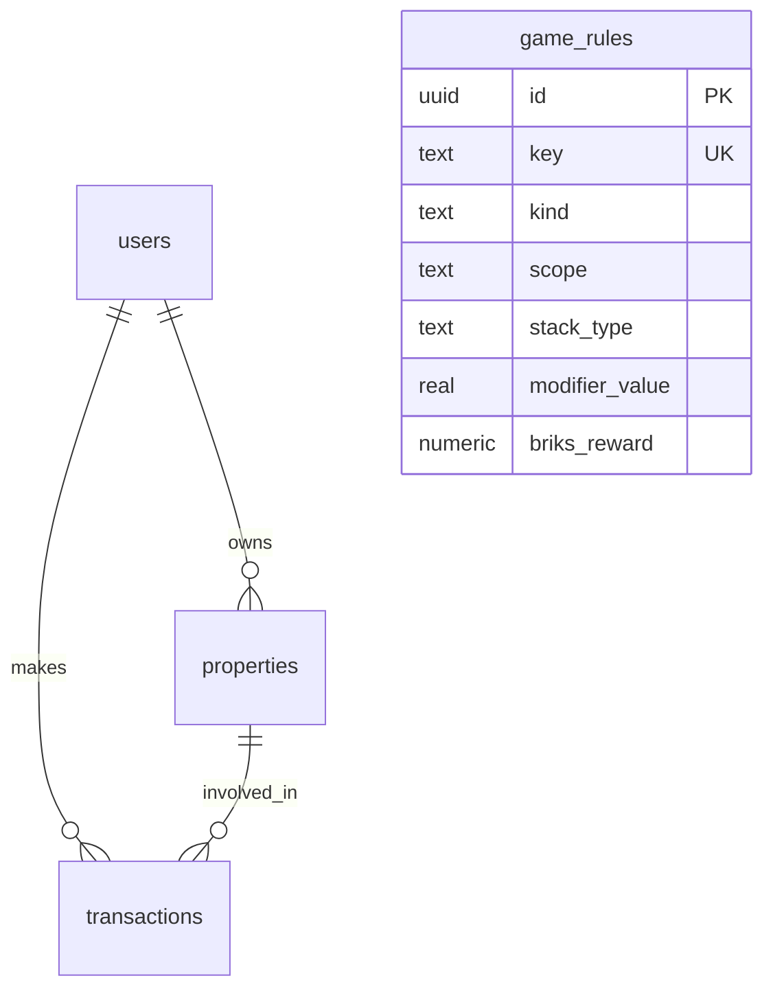

# Supabase Database Schema & Storage Guide (BCRS)

This document describes the current database schema, how the app connects to Supabase/Postgres, and where to find relevant code. It is intended for future contributors and AI agents to quickly understand the structure and conventions.

## Overview
- Engine: PostgreSQL (hosted on Supabase)
- ORM: Drizzle ORM with TypeScript types generated from `shared/schema.ts`
- Migrations: Drizzle Kit SQL files under `migrations/`
- Access layers:
  - Direct Postgres via `postgres` + Drizzle (`server/db.ts`, `server/db-storage.ts`)
  - Supabase REST via `@supabase/supabase-js` (`server/supabase-storage.ts`) as a fallback when direct DB is not available

The application prefers a direct Postgres connection if `DATABASE_URL` is configured and reachable. Otherwise, if Supabase URL and keys are present, it uses the Supabase client.

## Connection & Environment
- `DATABASE_URL`: Primary connection string for Postgres. When pointed at Supabase, we connect directly to the database.
- `NEXT_PUBLIC_SUPABASE_URL`: Used to derive a pooler host fallback if `DATABASE_URL` is a Supabase URL (see `server/db.ts`).
- `SUPABASE_POOLER_URL`: Optional explicit pooler URL override.
- `SUPABASE_SERVICE_ROLE` or `NEXT_PUBLIC_SUPABASE_ANON_KEY`: Used by the Supabase REST fallback (`server/supabase-storage.ts`). Prefer `SERVICE_ROLE` in server environments.

Connection precedence (see `server/db.ts`):
1) Try `DATABASE_URL`
2) Try derived pooler from `NEXT_PUBLIC_SUPABASE_URL` + `DATABASE_URL` creds
3) Try `SUPABASE_POOLER_URL`
4) If none work, fall back to Supabase REST if URL + key exist

## Where to Look in the Codebase
- Schema (source of truth): `shared/schema.ts`
- Drizzle config: `drizzle.config.ts`
- Migrations: `migrations/` (auto-generated or hand-authored SQL)
- Direct DB driver init: `server/db.ts`
- Drizzle-based storage implementation: `server/db-storage.ts`
- Supabase REST storage implementation: `server/supabase-storage.ts`
- Storage resolver (chooses driver): `server/storage.ts`

## Tables & Columns
Below summarizes the tables defined in `shared/schema.ts` and their intents. Data types refer to Postgres types as declared via Drizzle pg-core.

### users
- id uuid PRIMARY KEY — stable user id (intended to reference `auth.users` in Supabase projects)
- wallet_address text UNIQUE — optional, for wallet-linked accounts
- email text UNIQUE — optional, for email/username login
- password_hash text — optional (bcrypt)
- display_name text UNIQUE — player-visible name (enforce 5–12 chars at app level)
- briks_balance numeric DEFAULT '15000' — starting BRIKS
- has_completed_tutorial boolean DEFAULT false
- created_at timestamp DEFAULT now()
- subscribe_to_news boolean DEFAULT false — developer news opt-in
- net_worth numeric DEFAULT '0' — tracked statistic
- rank numeric DEFAULT '999' — leaderboard rank placeholder
- avatar_url text — preset avatar selection

Notes:
- We previously had a `username` column for migration convenience; it is now removed by `migrations/0003_remove_username.sql` after copying into `display_name` when needed.

### properties
- id uuid PRIMARY KEY DEFAULT gen_random_uuid()
- name text NOT NULL
- price numeric NOT NULL — list price in base units
- last_fixed date — maintenance date
- last_updated date — record update date
- listing_date date — first listed date
- location_cat numeric — categorical scoring (0–n)
- location text — human-readable location string
- income_cat numeric
- income numeric — periodic income basis
- turnover_cat numeric
- turnover real — fractional turnover (2-decimal float)
- demand_cat numeric
- demand numeric
- financed boolean — whether property has an active mortgage
- mortgage_remaining numeric — remaining principal
- school_cat numeric; school text
- amenity_cat numeric; amenity text
- tax_cat numeric; tax real — recurring tax rate/cost
- dues_cat numeric; dues numeric — HOA or similar
- insurance_cat numeric; insurance numeric
- rarity_cat numeric; rarity text — hidden rarity tier metadata
- condition numeric DEFAULT '100' — 0–100 condition health
- owner_id uuid REFERENCES users(id) — null indicates active listing

Frontend compatibility / derived fields
- briks_price numeric — convenience price in BRIKS (derived in app)
- monthly_income numeric — computed from daily/periodic income
- annual_roi numeric — computed percentage for display
- image_url text
- features text[] — string array for amenities/highlights
- bedrooms numeric; bathrooms numeric; sqft numeric; year_built numeric
- property_type text

### transactions
- id uuid PRIMARY KEY DEFAULT gen_random_uuid()
- user_id uuid NOT NULL REFERENCES users(id)
- property_id uuid REFERENCES properties(id)
- type text NOT NULL — e.g., 'purchase' | 'sale' | 'rent_payment'
- amount numeric NOT NULL
- created_at timestamp DEFAULT now()

### game_rules (unified rules for Achievements & Modifiers)
- id uuid PRIMARY KEY DEFAULT gen_random_uuid()
- kind text NOT NULL — 'achievement' | 'modifier' | 'hybrid'
- key text UNIQUE NOT NULL — stable key (e.g., FIRST_PURCHASE, SYNDICATE_MEMBER)
- name text NOT NULL; description text
- category text — PROGRESSION | MARKET | MAINTENANCE | AUCTION | SOCIAL | SEASONAL
- scope text — where modifiers apply: PROPERTY | PORTFOLIO | TRANSACTION
- stack_type text — ADDITIVE_PERCENT | MULTIPLICATIVE | FLAT | PICK_HIGHEST | PICK_LOWEST
- modifier_value real — percentage/ratio or flat amount; sign indicates credit/debit
- briks_reward numeric — optional BRIKS payout amount
- calculation text — free-form notes/pseudocode for how to evaluate
- validation text — optional textual validation criteria
- display text — UI hints (badge text, tooltip)
- is_active boolean DEFAULT true
- created_at timestamp DEFAULT now(); updated_at timestamp DEFAULT now()

Important:
- This table enables awarding both a BRIKS reward and a modifier concurrently for a single rule (per product requirement).
- As of this writing, `game_rules` exists in `shared/schema.ts`, but there may not yet be a corresponding migration in `migrations/`. See “Migrations Status” below.

## Relationships & Semantics
- properties.owner_id → users.id (nullable). If null, property is considered an active listing.
- transactions.user_id → users.id; transactions.property_id → properties.id (nullable for wallet-only transactions if any).
- Unique constraints: users.wallet_address, users.email, users.display_name.

## Migrations Status
- Initial tables created in `migrations/0000_bitter_luke_cage.sql` (users/properties/transactions minimal set)
- Additional columns added in `migrations/0001_famous_morlun.sql`
- Sync/patch migration in `migrations/0002_sync_schema.sql` (adds UI-facing columns and users fields)
- Username removal in `migrations/0003_remove_username.sql`
- Note: `game_rules` is defined in code but is not present in the committed migrations listed above. If your Supabase DB does not yet have `game_rules`, run Drizzle push after setting `DATABASE_URL`:

```bash
npm run db:push
```

This will reconcile the live database with `shared/schema.ts` and create a migration for `game_rules` if missing.

## Access Patterns (High Level)
- Server storage resolves driver in `server/storage.ts`:
  - Prefer Drizzle/pg (`server/db.ts` + `server/db-storage.ts`)
  - Else fallback to Supabase REST (`server/supabase-storage.ts`)
- Health and driver info exposed via `GET /api/health` in `server/routes.ts` (detects postgres vs supabase and status)
- Users are upserted by wallet or email uniqueness to avoid races (see `server/db-storage.ts`)
- Dashboard metrics derive Active Listings by `owner_id IS NULL`, Weekly Sales by recent `transactions`, etc.

## Conventions & Enumerations
- transactions.type is a free-text enum currently enforced at the application layer ('purchase' | 'sale' | 'rent_payment').
- Modifiers stack types and scopes for `game_rules` match the design in `docs/MODIFIER_ENGINE.md`.
- Rarity tiers exist as `rarity` text with associated `rarity_cat` numeric to support hidden tiering while allowing UI hints.

## Future Tables (Design Docs)
- Achievement Ledger tables are proposed in `docs/ACHIEVEMENT_LEDGER.md` and may be merged into or related to `game_rules` and a `player_achievements` table later.
- Modifier Engine proposes `modifier_sources` and `player_modifiers`; in this repository, `game_rules` currently covers source definitions, while applied/awarded instances would be modeled in future migrations.

## Operational Notes
- Use Supabase SQL Editor or psql to inspect schemas. Drizzle snapshots live under `migrations/meta/`.
- For Supabase connections, a pooler host may be automatically derived to improve stability (see `server/db.ts` `buildPoolerUrlFromEnv`).
- In-memory storage is intentionally disabled: the app throws when neither Postgres nor Supabase is configured to prevent silent data loss.

## Quick ER Diagram (Conceptual)


## Appendix: File Pointers
- `shared/schema.ts` — canonical schema definitions and TS types
- `migrations/` — SQL migrations applied to the database
- `drizzle.config.ts` — Drizzle migration config (uses `DATABASE_URL`)
- `server/db.ts` — DB connection setup (pg + drizzle)
- `server/db-storage.ts` — CRUD and queries using Drizzle
- `server/supabase-storage.ts` — CRUD via Supabase REST
- `server/routes.ts` — health/driver detection and API wiring

